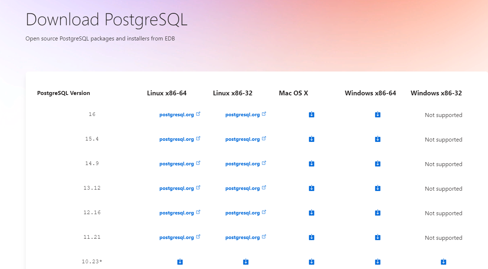
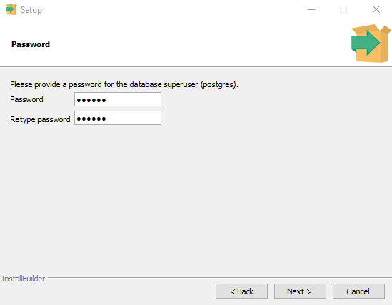
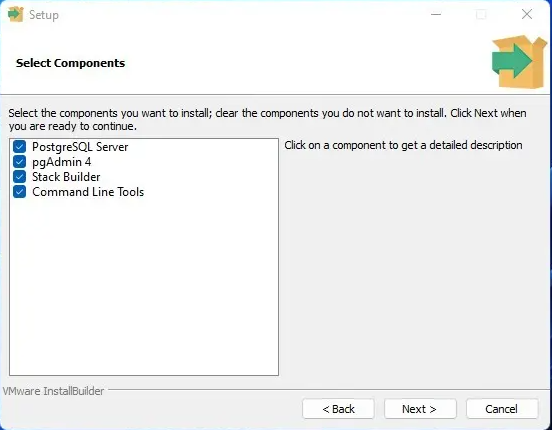
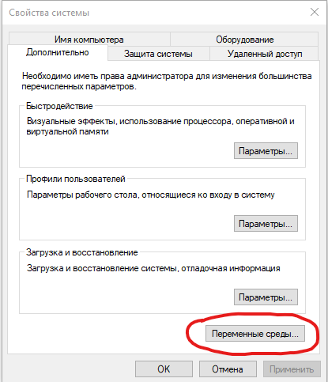
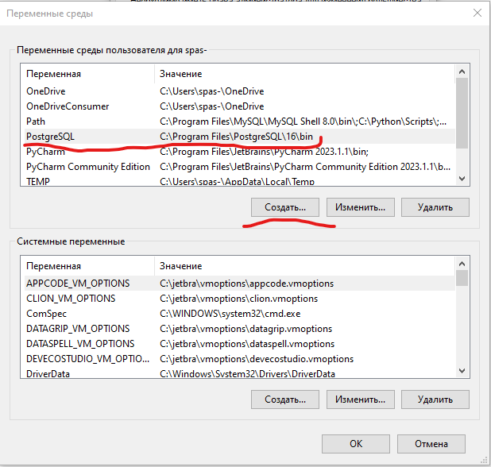
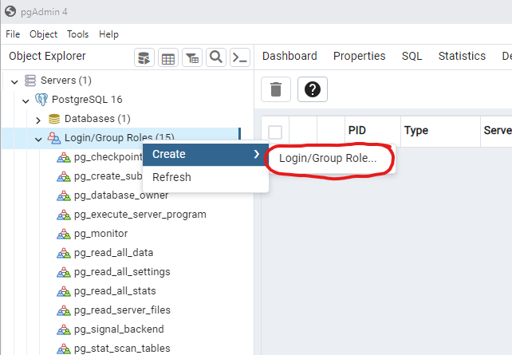
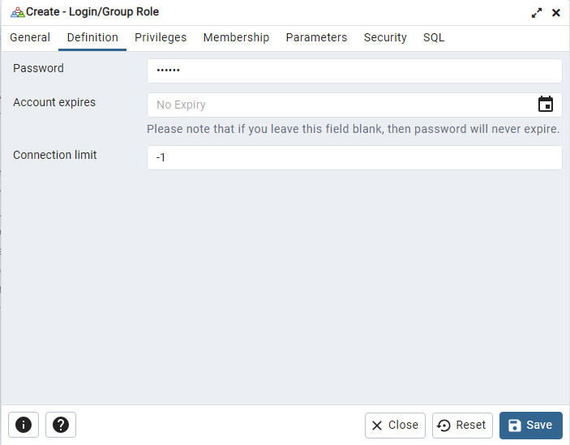
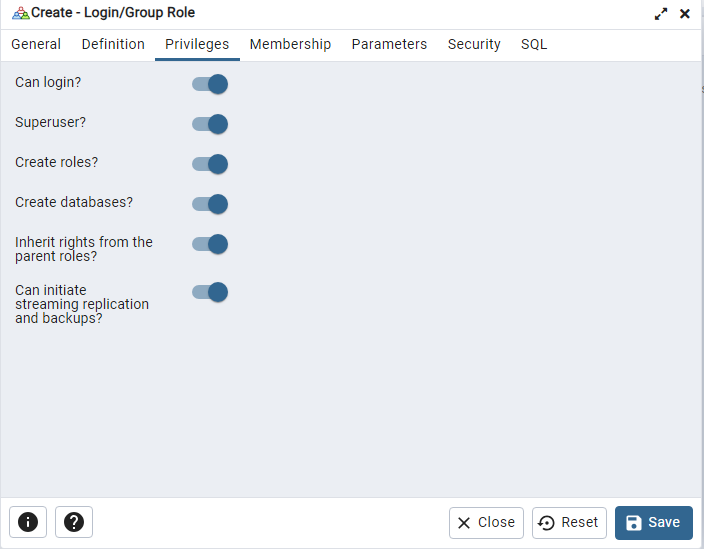
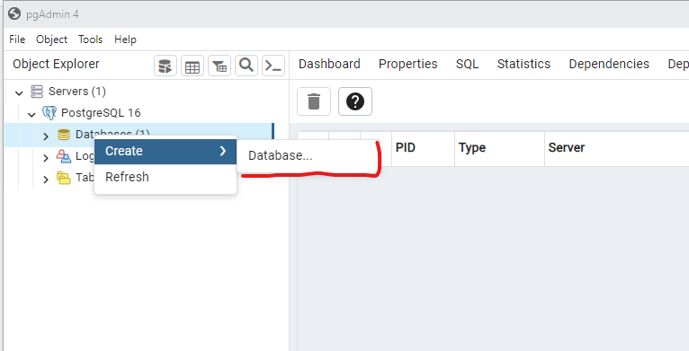

# Добро пожаловать в MEGANO 

## Руководство пользователя
_Командный проект_
### Содержание

* [Подготовка проекта](#подготовка-проекта)
* [Переменные окружения](#установка-и-настройка-переменных-окружения)
* [Установка PostrgreSQL](#установка-postrgresql)
* [Подключение базы к Django](#подключение-базы-к-django)
* [Установка Celery и Redis](#установка-и-подключение-celery-и-redis)
* [Настройка отправки сообщений в консоль](#настройка-отправки-сообщений-в-консоль)
* [Импорт продуктов из JSON файлов](#импорт-продуктов-из-json-файлов)
* [Путеводитель](#getting-started)

<hr>

## Подготовка проекта

* Ссылка для скачивания проекта доступна в [репозитории](https://gitlab.skillbox.ru/kurator_skillbox/python_django_team34.git)

* В кансоли, перейдите к проекту и установите виртуальное окружение командой
    - Структура проекта
    ```python
        Work_dir
          |____progect_name
          |____my_venv
          |____.gitignore
          |____README.md

    ```
```html
    python -m venv (your_name_env)
```

* После установки активируйте виртуальное окружение
    - <b>в Windows</b>
    ```html
        venv\Scripts\activate
    ```
    - <b>в UNIX system</b>
    ```html
        source (your_name_env)/bin/activate
    ```
    
* Установите все зависимости для запуска проекта
```html
    pip install -r requirements.txt
```
* Что бы посмотреть какие зависимости установлены, поможет команда
```html
    pip freeze
```

* <b>Проект готов к запуску</b>

<b>[↑ Содержание](#содержание)</b>

## Установка и настройка переменных окружения

Воспользуемся пакетом <u>[python-dotenv](#https://github.com/theskumar/python-dotenv)</u>. Он позволяет загружать переменные окружения из файла ***<u>.env</u>*** в корневом каталоге приложения.
Устанавливаем пакет:

```html
pip install python-dotenv
```
Теперь можно создать файл .env со всеми переменными среды, которые необходимы вашему приложению. 

<hr>

 ВАЖНО!
Назначение файла <u>.env</u> заключается в том, чтобы вынести конфиденциальные данные за пределы вашего проекта. Поэтому следует добавить <u>.env-файл</u> в <u>.gitignore</u>, что бы не хранить его в системе контроля версий.
<hr>

Надпомню **Файл <u>.env</u> должен находиться в корневом каталоге проекта**

* Пример содержания файла <u>.env</u>
    ```python
    API_KEY='very_secret_password'
    SECRET_KEY='your_secret_key'
    TOKEN='token'
    ```
* В <u>settings.py</u> импортируем библиотеку и настраиваем переменные
    
    ```python
    import os
    from dotenv import load_dotenv
    
    # поиск файла .env и загрузки из него переменных среды
    load_dotenv()

    # сохраняем в переменные значения из словаря по ключу
    DEBUG = True if os.getenv('DEBUG') == "True" else False
    SECRET_KEY = os.getenv('SECRET_KEY')
    ALLOWED_HOSTS = os.getenv('ALLOWED_HOSTS').split(',')
    DATABASES = {
        'default': {
            'ENGINE': os.getenv('DB_ENGINE_SQLITE'),
            'NAME': BASE_DIR / os.getenv('DB_NAME_SQLITE'),
        } if DEBUG else { # если DEBUG=True, то устанавливается база sqlite3 
            'ENGINE': os.getenv('DB_ENGINE'),
            'NAME': os.getenv('DB_NAME'),
            'USER': os.getenv('DB_USER'),
            'PASSWORD': os.getenv('DB_PASSWORD'),
            'HOST': os.getenv('DB_HOST'),
        }
    }
    ```
<b>[↑ Содержание](#содержание)</b>

## Установка PostrgreSQL
* [Windows](#установка-и-создание-бд-в-windows)
* [Linux](#установка-и-создание-бд-в-linux)
* [Mac OS](#установка-в-mac-os)

* Для установки перейдите на <u>[официальный сайт](https://www.enterprisedb.com/downloads/postgres-postgresql-downloads)</u> и загрузите установщик, скачивайте последнюю версию.

    

________

### Установка  и создание БД в Windows
* Запустите скачанный файл установщика. Все оставляем по умолчанию.
    -  По пути установите "мастер пароль" для сервера базы данных.
    - В поле "Stack Builder" (опционально) можно снять галочку.

    
    

* После завершения установки PostgreSQL вы можете использовать его для создания и управления базами данных, которые будут использоваться в вашем проекте Django.

* Добавляем путь в среду переменных Windows
    - <b>Открываем свойства Системы</b>

    

    - <b>Кликаем "Создать" в полях прописываем название перем енной и вставляем путь как на скрине</b>
    

* Открываем приложение <u>pgAdmin4</u>. В меню "Пуск - PostgreSQL - pgAdmin"
    - По умолчанию создается база данных "postghres" с пользователем "postgres"

    - <b>Создаем нашего пользователя</b>
    
    
    - <b>Устанавливаем пароль</b>
    
    
    - <b>Раздаем привелегии и сохраняем кнопкой <u>SAVE</u></b>
    

    - <b>Создаем базу данных</b>
    

    - <b>Вписываем имя БД, выбираем нашего пользователя и сохраняем кнопкой <u>SAVE</u></b>
    

    - <b>База данных создана и готова к использованию. Перехоидите к [Подключению базы к Django](#подключение-базы-к-django)</b>

<b>[↑ Содержание](#содержание)</b>

__________

### Установка и создание бд в Linux

* Установка компонентов из репозиториев Linux Ubuntu.
  Сначала обновим кэш менеджера пакетов с помощью apt:

```html
sudo apt update
```

* Затем установим Postgres и связанные с ним библиотеки:

```html
sudo apt install python3-pip python3-dev libpq-dev postgresql postgresql-contrib
```

* Во время установки Postgres в ОС был создан пользователь postgres, который соответствует пользователю postgres (администратору PostgreSQL). Этого пользователя необходимо использовать для выполнения административных задач. Перехоидим в консоль PostrgreSQL командой:

```html
sudo -i -u postgres psql
```

* Затем создадим базу данных для проекта Django. Также обращаем внимание на то, что важно не забывать заканчивать команды в командной строке SQL точкой с запятой — ; 

```html
CREATE DATABASE megano_db;
```

* Создадим пользователя базы данных и зададим пароль:

```html
CREATE USER megano WITH PASSWORD '123456';
```

* Установим кодировку по умолчанию на UTF-8:
```html
ALTER ROLE myproject_user SET client_encoding TO 'utf8';
```
* Затем установим схему изоляции транзакций по умолчанию на чтение с фиксацией, блокирующее чтение из незафиксированных транзакций:

```html
ALTER ROLE myproject_user SET default_transaction_isolation TO 'read committed';
```

* Установим часовой пояс. По умолчанию в проекте Django настроено использование UTC:

```html
ALTER ROLE myproject_user SET timezone TO 'UTC';
```

* И предоставим пользователю права доступа к созданной базе данных:

```html
GRANT ALL PRIVILEGES ON DATABASE myproject TO myproject_user;
```

Выход из командной строки SQL

```html
\q
```

<b>[↑ Содержание](#содержание)</b>
__________

### Установка в Mac OS

```html
# TODO Дописать инструкцию по установке БД под Mac OS
```

<b>[↑ Содержание](#содержание)</b>

## Подключение базы к Django

* После установки PostgreSQL необходимо настроить Django проект для связи с базой данных. Для этого нужно внести изменения в файл настроек проекта – settings.py. Откройте этот файл и найдите раздел DATABASES

    - ENGINE – указать, что используется база данных PostgreSQL;
    - NAME – имя базы данных, которую вы создали;
    - USER – имя пользователя базы данных;
    - PASSWORD – пароль пользователя;
    - HOST – адрес базы данных (обычно 127.0.0.1 для локальной базы данных);
    - PORT – порт на котором работает база данных (обычно 5432).

    ```python
        DATABASES	=	{
        ‘default’:	{
            ‘ENGINE’: ‘django.db.backends.postgresql’,	
            ‘NAME’: ‘mydatabase’,	
            ‘USER’: ‘mydatabaseuser’,	
            ‘PASSWORD’: ‘mypassword’,	
            ‘HOST’: ‘localhost’,	
            ‘PORT’: ‘5432’,	
            }	
        }
    ```

* Установка драйвера <b>psycorg2</b>

```html
    pip install psycopg2
    # альтернатива
    pip install psycopg2-binary
```
* После успешной установки psycopg2 его можно использовать в Django. Перед запуском миграций создайте [переменные окружения](#установка-и-настройка-переменных-окружения)

* Применяем миграции 
    * Перейдите в "progect_name" и воспользуйтесь командой
    - Структура проекта:

        ```python
        Work_dir
          |____progect_name
          |      |_____progect_name
          |      |_____manage.py
          |____my_venv
          |____.gitignore
          |____README.md
        ```

    ```html
        pip manage.py makemigrations
        pip manage.py migrate
    ```

## Установка и подключение Celery и Redis

Начните установку с Redis. Перейдите по следующей ссылке на [официальный сайт](https://redis.io/docs/install/install-redis/) и выберите установку, соответствующую вашей системе.

<hr>

 ВАЖНО!
Не забудьте запустить Redis
<hr>

Далее установите Celery командой
```
pip install celery
```

В файле .env пропишите константы:
  - REDIS_NAME – номер базы данных для Celery;
  - REDIS_HOST – адрес Redis;
  - REDIS_PORT – порт Redis.

Стандартные настройки:
```
REDIS_HOST=localhost
REDIS_PORT=6379
REDIS_NAME=0
```

В проекте реализованы две очереди задач: на оплату и на импорт json-файлов.

Команда для запуска очереди оплаты
```
 celery -A megano worker -l info -Q payment 
```

Команда для запуска очереди импорта
```
celery -A megano worker -l info -Q json_import
```

Запустить сразу оба воркера
```
celery -A megano worker -l info -Q payment,json_import -c 1
```

## Настройка отправки сообщений в консоль

Сообщения администратору отправляются автоматически после проведения успешного/неуспешного импорта.
Для этого используется модуль <b>django.core.mail</b>.

В файле .env пропишите константы:
- EMAIL_HOST – хост для отправки электронной почты;
- EMAIL_PORT – порт для отправки электронной почты;
- EMAIL_HOST_USER – username пользователя для прохождения аутентификации на SMTP-сервере; 
- EMAIL_HOST_PASSWORD – пароль к указанному username;
- DEFAULT_FROM_EMAIL – email, от кого будет отправка сообщений по умолчанию;
- EMAIL_BACKEND – django.core.mail.backends.console.EmailBackend

Стандартные настройки:
```
EMAIL_HOST = localhost
EMAIL_PORT = 1025
EMAIL_HOST_USER = None
EMAIL_HOST_PASSWORD = None
DEFAULT_FROM_EMAIL = admin@example.com
EMAIL_BACKEND = django.core.mail.backends.console.EmailBackend
```
Если в EMAIL_HOST_USER и EMAIL_HOST_PASSWORD не переданы значения, то аутентификация проводиться не будет.

Запустить работу почты с помощью встроенного SMTP-сервера Python:
```
python -m smtpd -n -c DebuggingServer localhost:1025
```

#### Поздравляем вы установили проект и базу данных!


## Импорт продуктов из JSON файлов

Загрузить один или несколько файлов можно из админки в разделе **Товары**, либо **консольной командой**, 
если файлы предварительно загружены в проект. Ознакомиться с примером структуры
такого файла можно в **import/files_for_import**, куда рекомендуется складывать файлы 
подготовленные для импорта.

Пример консольной команды:
```
python manage.py upload_file files_for_import test@test.test
```
- *files_for_import* - директория, из которой нужно импортировать файлы, 
может быть заменена на конкретный файл: *example.json*.
- test@test.test - адрес администратора, которому нужно отправить результат.
Является обязательным.

Если импорт уже запущен, необходимо дождаться его окончания, прежде чем добавить
следующий. Отследить статус импорта можно на странице загрузки товаров в 
административном разделе `.../admin/store/product/import-offers-json/`.

<b>[↑ Содержание](#содержание)</b>
__________

## Getting started

To make it easy for you to get started with GitLab, here's a list of recommended next steps.

Already a pro? Just edit this README.md and make it your own. Want to make it easy? [Use the template at the bottom](#editing-this-readme)!

## Add your files

- [ ] [Create](https://docs.gitlab.com/ee/user/project/repository/web_editor.html#create-a-file) or [upload](https://docs.gitlab.com/ee/user/project/repository/web_editor.html#upload-a-file) files
- [ ] [Add files using the command line](https://docs.gitlab.com/ee/gitlab-basics/add-file.html#add-a-file-using-the-command-line) or push an existing Git repository with the following command:

```
cd existing_repo
git remote add origin https://gitlab.skillbox.ru/kurator_skillbox/python_django_team34.git
git branch -M master
git push -uf origin master
```

## Integrate with your tools

- [ ] [Set up project integrations](https://gitlab.skillbox.ru/kurator_skillbox/python_django_team34/-/settings/integrations)

## Collaborate with your team

- [ ] [Invite team members and collaborators](https://docs.gitlab.com/ee/user/project/members/)
- [ ] [Create a new merge request](https://docs.gitlab.com/ee/user/project/merge_requests/creating_merge_requests.html)
- [ ] [Automatically close issues from merge requests](https://docs.gitlab.com/ee/user/project/issues/managing_issues.html#closing-issues-automatically)
- [ ] [Enable merge request approvals](https://docs.gitlab.com/ee/user/project/merge_requests/approvals/)
- [ ] [Automatically merge when pipeline succeeds](https://docs.gitlab.com/ee/user/project/merge_requests/merge_when_pipeline_succeeds.html)

## Test and Deploy

Use the built-in continuous integration in GitLab.

- [ ] [Get started with GitLab CI/CD](https://docs.gitlab.com/ee/ci/quick_start/index.html)
- [ ] [Analyze your code for known vulnerabilities with Static Application Security Testing(SAST)](https://docs.gitlab.com/ee/user/application_security/sast/)
- [ ] [Deploy to Kubernetes, Amazon EC2, or Amazon ECS using Auto Deploy](https://docs.gitlab.com/ee/topics/autodevops/requirements.html)
- [ ] [Use pull-based deployments for improved Kubernetes management](https://docs.gitlab.com/ee/user/clusters/agent/)
- [ ] [Set up protected environments](https://docs.gitlab.com/ee/ci/environments/protected_environments.html)

***

# Editing this README

When you're ready to make this README your own, just edit this file and use the handy template below (or feel free to structure it however you want - this is just a starting point!). Thank you to [makeareadme.com](https://www.makeareadme.com/) for this template.

## Suggestions for a good README
Every project is different, so consider which of these sections apply to yours. The sections used in the template are suggestions for most open source projects. Also keep in mind that while a README can be too long and detailed, too long is better than too short. If you think your README is too long, consider utilizing another form of documentation rather than cutting out information.

## Name
Choose a self-explaining name for your project.

## Description
Let people know what your project can do specifically. Provide context and add a link to any reference visitors might be unfamiliar with. A list of Features or a Background subsection can also be added here. If there are alternatives to your project, this is a good place to list differentiating factors.

## Badges
On some READMEs, you may see small images that convey metadata, such as whether or not all the tests are passing for the project. You can use Shields to add some to your README. Many services also have instructions for adding a badge.

## Visuals
Depending on what you are making, it can be a good idea to include screenshots or even a video (you'll frequently see GIFs rather than actual videos). Tools like ttygif can help, but check out Asciinema for a more sophisticated method.

## Installation
Within a particular ecosystem, there may be a common way of installing things, such as using Yarn, NuGet, or Homebrew. However, consider the possibility that whoever is reading your README is a novice and would like more guidance. Listing specific steps helps remove ambiguity and gets people to using your project as quickly as possible. If it only runs in a specific context like a particular programming language version or operating system or has dependencies that have to be installed manually, also add a Requirements subsection.

## Usage
Use examples liberally, and show the expected output if you can. It's helpful to have inline the smallest example of usage that you can demonstrate, while providing links to more sophisticated examples if they are too long to reasonably include in the README.

## Support
Tell people where they can go to for help. It can be any combination of an issue tracker, a chat room, an email address, etc.

## Roadmap
If you have ideas for releases in the future, it is a good idea to list them in the README.

## Contributing
State if you are open to contributions and what your requirements are for accepting them.

For people who want to make changes to your project, it's helpful to have some documentation on how to get started. Perhaps there is a script that they should run or some environment variables that they need to set. Make these steps explicit. These instructions could also be useful to your future self.

You can also document commands to lint the code or run tests. These steps help to ensure high code quality and reduce the likelihood that the changes inadvertently break something. Having instructions for running tests is especially helpful if it requires external setup, such as starting a Selenium server for testing in a browser.

## Authors and acknowledgment
Show your appreciation to those who have contributed to the project.

## License
For open source projects, say how it is licensed.

## Project status
If you have run out of energy or time for your project, put a note at the top of the README saying that development has slowed down or stopped completely. Someone may choose to fork your project or volunteer to step in as a maintainer or owner, allowing your project to keep going. You can also make an explicit request for maintainers.

<b>[↑ Содержание](#содержание)</b>
